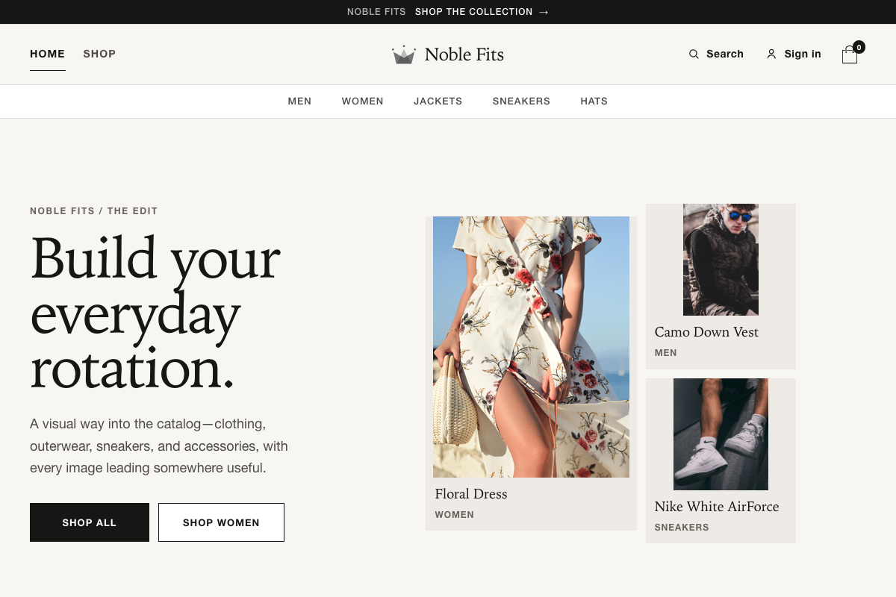

# Noble Fits

A responsive React storefront built as a portfolio project: browse a 35-product catalog, filter and search collections, inspect products, and manage a persistent shopping bag. Firebase powers account access; Stripe integration is restricted to test payments.



[View the mobile layout](docs/screenshots/mobile.png)

## What you can explore

- Home-page merchandising with unique product imagery and linked collections.
- Collection and price filters, sorting, typo-tolerant search, and recent searches.
- Product details, quantity controls, availability states, and related products.
- A browser-persisted bag with quantity changes, removal, and checkout totals.
- Email/Google sign-in, registration, password recovery, and protected account routes.
- Responsive navigation, keyboard-accessible drawers, image fallbacks, error recovery, and 404 pages.

## Run locally

Use **Node 24** (`nvm use`) and npm 10+. This repository is an npm workspace; run commands from the project root.

```bash
npm ci
npm run doctor
npm run dev
```

Open [localhost:3000](http://localhost:3000). The frontend runs independently; the Express server is only needed for test payment requests.

For first-time configuration, copy `client/.env.example` to `client/.env.local`. Keep any existing environment values when updating your setup. To explore the bundled catalog without depending on a remote catalog service, set:

```dotenv
VITE_CATALOG_SOURCE=local
```

Leave this unset to load Firestore collections with a bundled-data fallback. Account features still use Firebase; configure your own `VITE_FIREBASE_*` values and authorized domains to test authentication against a project you control. No credentials are needed for the automated test suites.

### Optional Stripe test checkout

Set `VITE_STRIPE_PUBLISHABLE_KEY=pk_test_...` in `client/.env.local`, and `STRIPE_SECRET_KEY=sk_test_...` in the root `.env` (see the root `.env.example`). Then run:

```bash
npm run dev:full
```

Vite runs on port 3000 and proxies `/payment` to Express on port 5000. The server starts without a Stripe key, but returns a controlled unavailable response for payment requests. It refuses live Stripe keys. Never put server secrets in `VITE_*` variables.

## Architecture

| Area                          | Responsibility                                          |
| ----------------------------- | ------------------------------------------------------- |
| `client/src/pages`            | Small page compositions and feature-local hooks/styles  |
| `client/src/components`       | Reusable feature UI and external-component wrappers     |
| `client/src/design-system`    | Shared, accessible UI primitives and design tokens      |
| `client/src/hooks`            | Shared catalog, cart, search-history, and browser hooks |
| `client/src/api`              | Domain services and HTTP/Firebase adapters              |
| `client/src/redux`            | Store, selectors, persistence, and saga orchestration   |
| `client/src/config/routes.js` | Centralized navigation paths and route builders         |
| `server`                      | Test-payment endpoint and its validation                |

The frontend uses React, React Router, Redux Toolkit/Saga, Vite, SCSS, Firebase, and Stripe Elements. Application startup triggers catalog/session loading once; pages subscribe through hooks. User actions initiate mutations directly, and filters/totals are derived from current data. Vendor integrations stay behind app-owned adapters.

See the [frontend style guide](client/md/FRONTEND_STYLE_GUIDE.md) for implementation conventions and the [testing guide](client/md/TESTING.md) for the test strategy and remaining verification boundaries.

## Quality checks

| Command                 | Purpose                                                                                   |
| ----------------------- | ----------------------------------------------------------------------------------------- |
| `npm run validate`      | Lint, formatting, feature checks, Jest coverage gates, production build, and server tests |
| `npm test`              | Frontend unit/component/integration tests and server contract tests                       |
| `npm run test:coverage` | Coverage report in `client/coverage`                                                      |
| `npm run test:e2e`      | Build a deterministic demo and run desktop/mobile browser journeys                        |
| `npm run build`         | Production frontend build in `client/build`                                               |
| `npm run preview`       | Preview the current production build                                                      |
| `npm run dev:full`      | Start the frontend and test-payment server together                                       |

[GitHub Actions](.github/workflows/ci.yml) runs validation and browser journeys on pushes and pull requests, and uploads coverage and screenshot evidence. Local pre-commit hooks run lint-staged; CI runs independently of those hooks.

Browser tests use the bundled catalog and disable the payment UI; they do not create accounts or submit charges. `test:e2e` rebuilds `client/build` with that configuration, so run `npm run build` again with your intended environment before deployment. If the browser binary is missing, run `npx cypress install`. The test runner clears an inherited `ELECTRON_RUN_AS_NODE` flag automatically.

## Portfolio demo scope

This is a demonstrable storefront, **not a production commerce backend**. The test-payment flow accepts a client-supplied amount and does not implement server-owned pricing, orders, fulfillment, shipping/tax calculation, webhooks, or payment idempotency. The bag is local to one browser, not synchronized to accounts. Firebase security rules and project configuration are managed outside this repository.

Product photos are externally hosted demo assets. Broken images have accessible fallbacks; the original images are small, so the larger homepage panels display them without enlargement. Asset ownership/licensing is not documented in this repository and should be established before redistribution or commercial use.

## Build and deployment

For a static portfolio deployment, build with `VITE_CATALOG_SOURCE=local`, upload `client/build`, and configure SPA fallback to `index.html` for client-side routes. Vite environment variables are compiled into the bundle. Static hosting supports catalog and bag exploration; `/payment` needs a separately hosted backend.

For Express hosting, build first, then run `NODE_ENV=production npm start`. Express serves the build and handles direct links to frontend routes. Keep Stripe in test mode. The build currently reports a large vendor bundle warning; bundle-size optimization remains an opportunity.

See [production-readiness notes](client/md/PRODUCTION_READINESS.md) for the boundary between this demo and a real-money store. No live deployment is configured or published by this repository's CI workflow.
